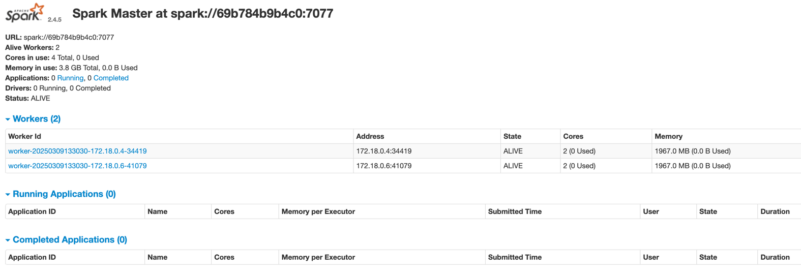

# Installation Instructions
 

**IMPORTANT**: *Any installation requires at least 8Gb of RAM for proper operation.*

1. Install Docker Desktop

	  **Using Windows**: Install docker desktop https://docs.docker.com/desktop/install/windows-install/
	
	  **Using MacOS**: Follow instructions in the below link to setup your MacOS https://docs.docker.com/desktop/install/mac-install/ 
	  
2. Ensure Docker Desktop is up and running

3. Spin-up Spark cluster: 
	
	a. Open shell (**Windows**: Windows Powershell/ **MacOS**: bash or any available shell)
	
	b. Change directory to the /AUE_workshop2025
		
		cd {project1-directory}
	
	c. Docker compose
	
		docker compose -f ./docker-compose.yml --project-name aue_workshop2025 up

### Validation

1. Open Docker desktop and check for **AUE_workshop2025** project having 5 containers as below

	 
	
2. Spark Cluster is up and running. Go to http://localhost:8080/. You should get a Spark Master UI with 2 worker nodes -
	
     

